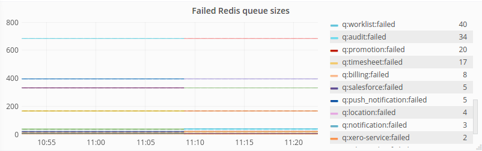

## Redis lenght prometheus

Redis key length exporter for prometheus 

Output sample: 

```
# TYPE redis_queue_size counter
redis_queue_size{queue="q:message_audit"} 363
redis_queue_size{queue="q:comms:completed"} 102634
redis_queue_size{queue="q:timesheet:failed"} 17
redis_queue_size{queue="q:location:completed"} 18
redis_queue_size{queue="q:session:skipped"} 98630
redis_queue_size{queue="q:notification:completed"} 1149
redis_queue_size{queue="q:salesforce:failed"} 5
redis_queue_size{queue="q:notification:skipped"} 101854
redis_queue_size{queue="q:messagecentre:failed"} 2
redis_queue_size{queue="q:timesheet:completed"} 2421
redis_queue_size{queue="q:user:completed"} 232
```



## Available on docker hub as public image 

[rephus/redis-length-prometheus](https://hub.docker.com/r/rephus/redis-length-prometheus/)


## Env vars

deployment.yaml 
```
      - env:
        - name: PORT
          value: "8001"
        - name: REDIS_HOST
          value: redis
```

* PORT: Port where NodeJS express interface is running, make sure this port matches the prometheus annotation 

```
    metadata:
      annotations:
        prometheus.io/port: "8001"
        prometheus.io/scrape: "true"
```

* REDIS_HOST: The redis host, you might want to use `redis` , `redis.namespace` or  AWS elasticcache url `...0001.euw1.cache.amazonaws.com`